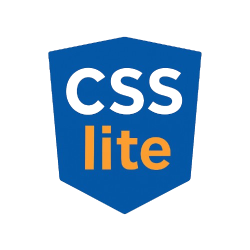

# CSSlite

<p align="center">
  
</p>

CSSlite is a simplified CSS language designed to make styling websites easier and more readable.

## Syntax

Write CSSlite code like this:

```css
h1:
color = red
size = 32
p:
color = blue
size = 16
weight = bold
```

- Each selector ends with a colon (`:`)  
- Properties use `=` instead of `:`  
- `size` means `font-size` with `px` appended automatically  
- Supports basic CSS properties like `color`, `weight`, `bg` (background-color), `margin`, and `padding`.

## Usage

You can use the parser in `src/parser.js` in your Node.js projects or open `demo/index.html` in a browser to try CSSlite live.

## Running tests

This project uses [Jest](https://jestjs.io/) for testing.

```bash
npm install
npm test
